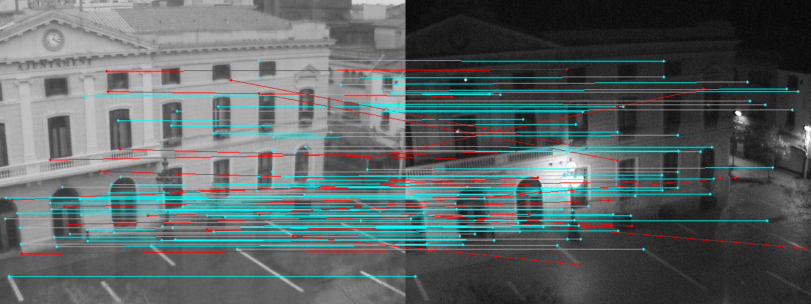
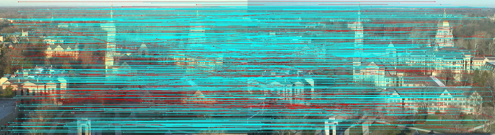
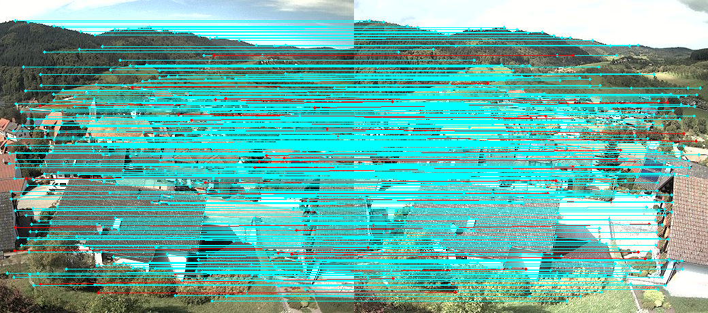
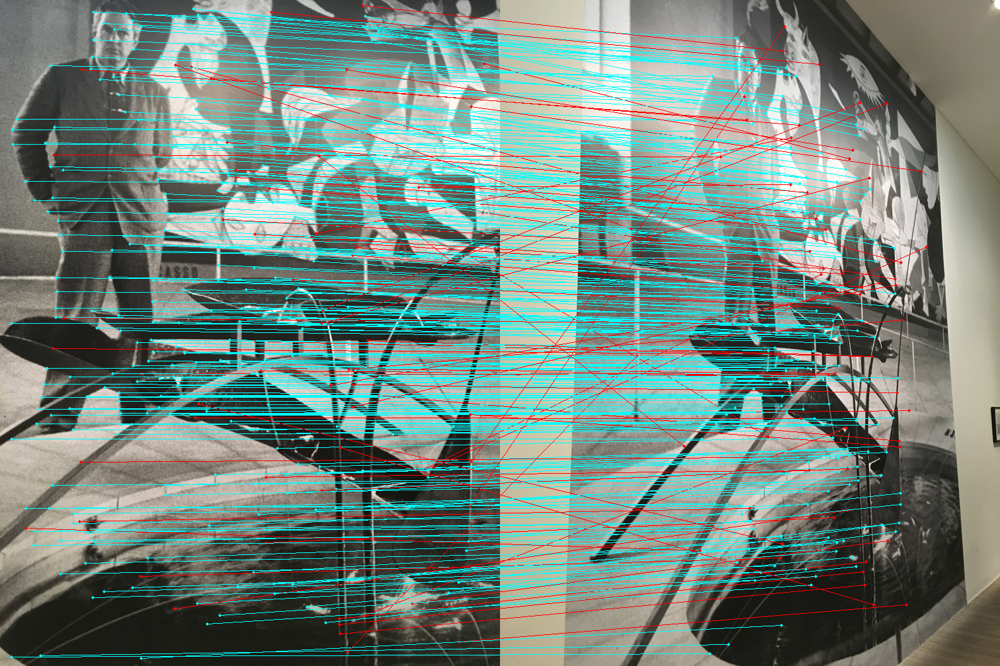
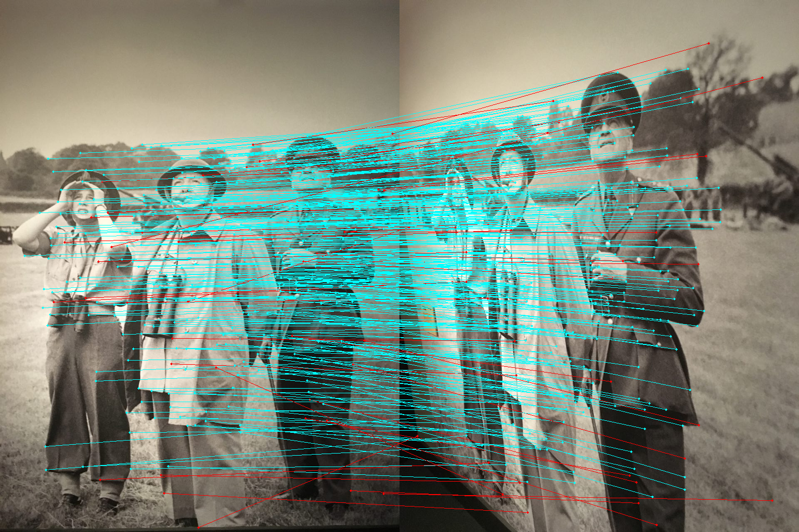
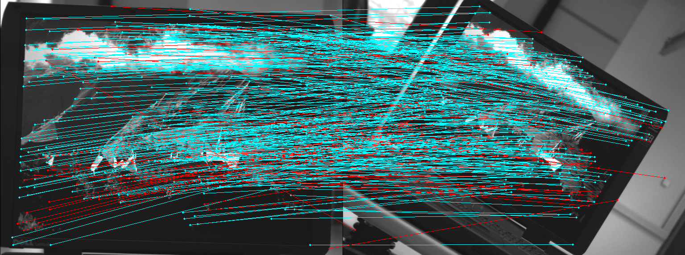
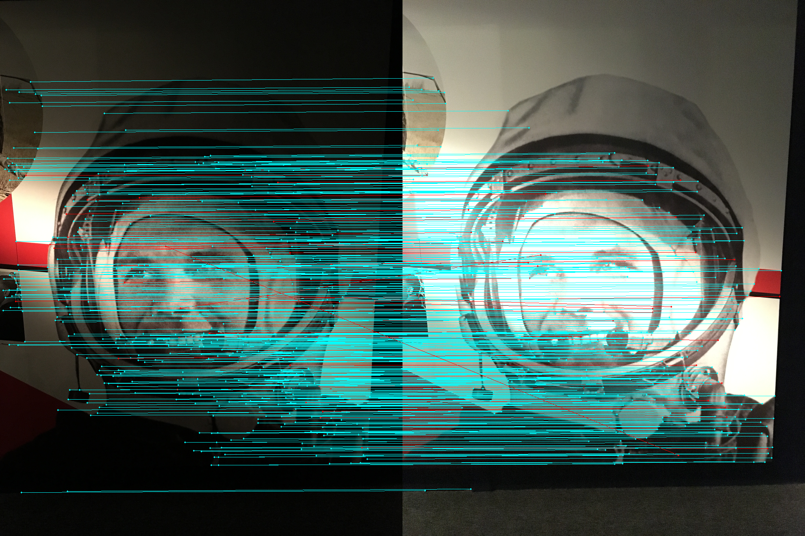

# neuro-fem

This repository currently contains code of *GoodPoint: unsupervised learning of keypoint detection and description* https://arxiv.org/abs/2006.01030.
And some unfinished models. Below some examples of keypoints extracted from hpatches dataset.

